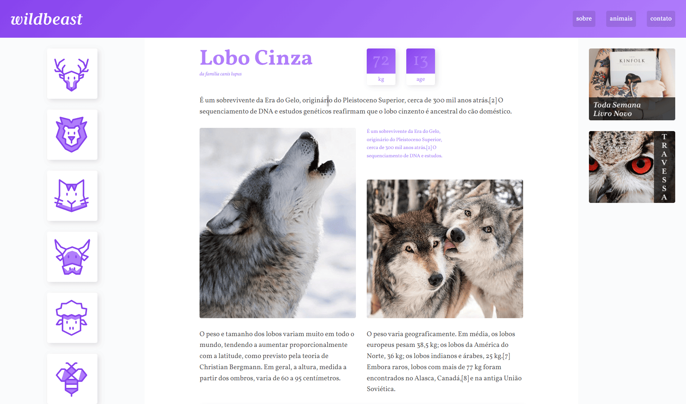

# Wildbeast

  

## 📋 Sobre

Site informativo sobre animais selvagens com design moderno, desenvolvido com **HTML5, CSS3 e JavaScript puro**. O projeto demonstra boas práticas de desenvolvimento web, design responsivo e interface intuitiva.

## ✨ Funcionalidades

- 🎨 Design responsivo mobile-first
- 🐾 Navegação intuitiva por ícones de animais
- 📱 Interface elegante e moderna

## 🛠️ Tecnologias

- **HTML5**: Marcação semântica
- **CSS3**: Grid, Flexbox, Animações

---

⭐ **Projeto de estudos em desenvolvimento web**

