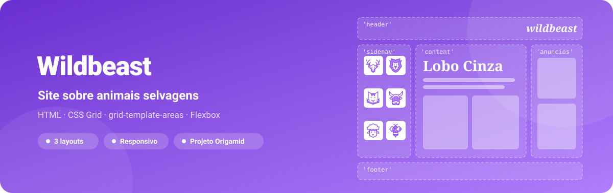
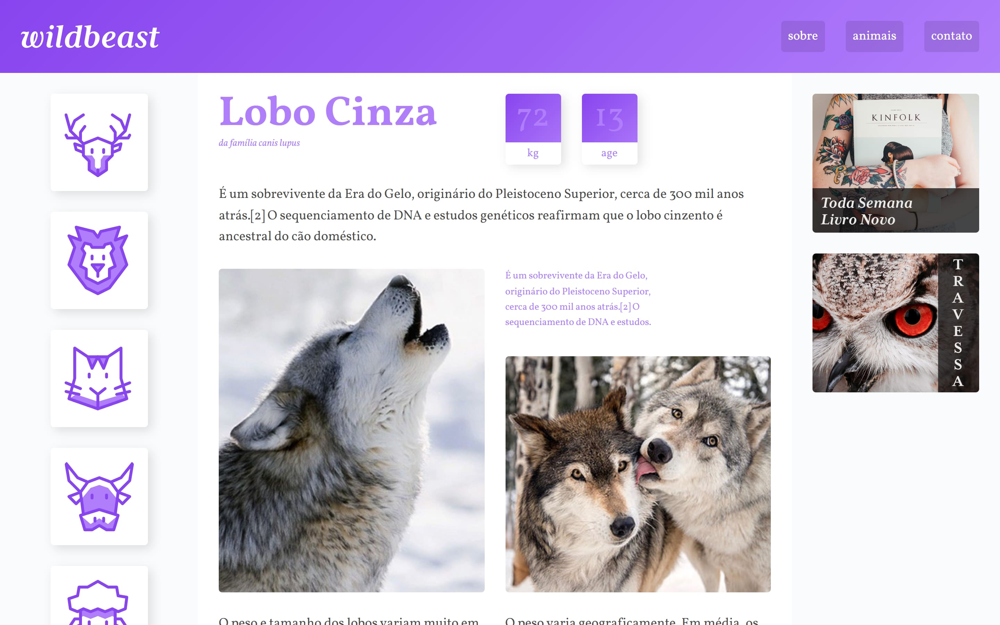
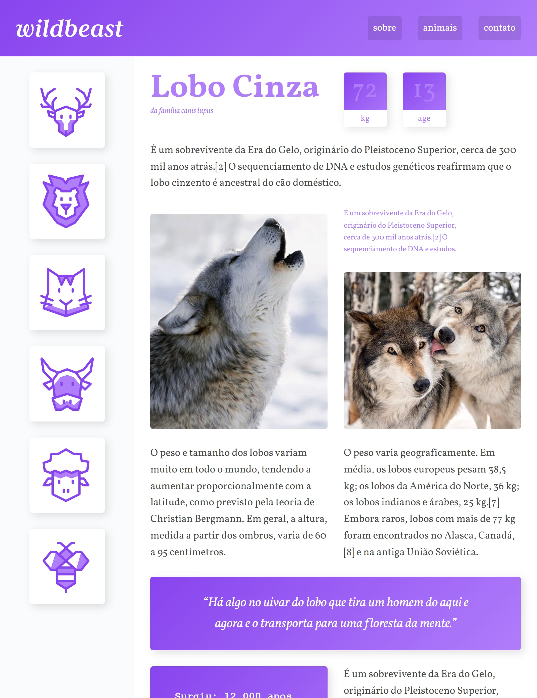
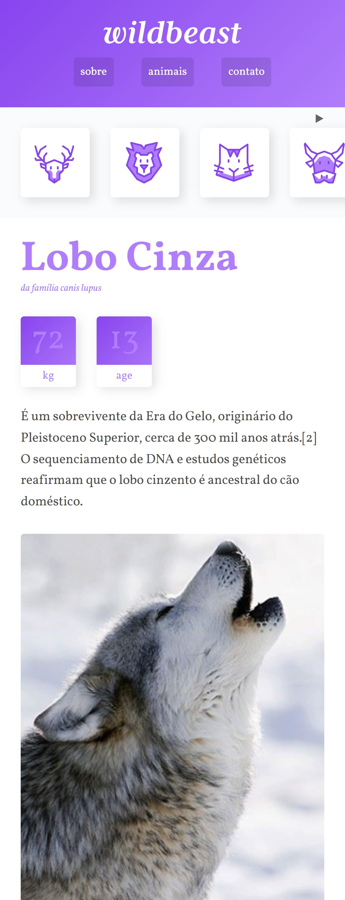

<div align="center">



**Página sobre animais selvagens montada com CSS Grid: três colunas no desktop, duas no tablet e uma no celular.**

[](https://kessleru.github.io/Wildbeast-Web/)
[](https://github.com/kessleru/Wildbeast-Web/actions/workflows/pages/pages-build-deployment)
[](https://github.com/kessleru/Wildbeast-Web/commits/main)



</div>

## Sobre

A Wildbeast é uma página de ficha de animal — aqui, o **Lobo Cinza** — com menu lateral de ícones,
estatísticas, galeria de fotos, citação em destaque, ficha técnica e uma coluna de anúncios. É um
projeto da [Origamid](https://www.origamid.com), feito só com HTML e CSS.

O ponto do projeto é o layout: a página inteira é um único grid descrito por
`grid-template-areas`, e cada breakpoint redesenha o mapa de áreas em vez de mexer em larguras e
floats.

## Telas

### Tablet — abaixo de 1200px

A coluna de anúncios desce para baixo do conteúdo e o menu de ícones ocupa a lateral inteira.



### Celular — abaixo de 760px

<table>
<tr>
<td width="50%"></td>
<td width="50%">

Tudo vira uma coluna só, na ordem `header → sidenav → content → anuncios → footer`, e o menu de
ícones passa a ser uma faixa com rolagem horizontal.

</td>
</tr>
</table>

## O grid

```css
.estrutura {
  grid-template-columns: minmax(160px, 1fr) 3fr 300px;
  grid-template-areas:
    'header  header  header'
    'sidenav content anuncios'
    'footer  footer  footer';
}

@media (max-width: 1200px) {
  .estrutura {
    grid-template-columns: minmax(160px, 1fr) 3fr;
    grid-template-areas:
      'header  header'
      'sidenav content'
      'sidenav anuncios'
      'footer  footer';
  }
}
```

## Funcionalidades

| | |
|---|---|
| 🧩 **Layout por áreas** | `grid-template-areas` redesenhado em 1200px, 760px e 600px |
| 🐾 **Menu de ícones** | Seis animais em SVG na lateral, que viram uma faixa com rolagem horizontal no celular |
| 🖼️ **Galeria** | Fotos em grid de duas colunas e uma imagem em largura total |
| 📋 **Ficha técnica** | Lista estilizada com fonte monoespaçada |
| 📰 **Anúncios** | Coluna própria no desktop, com texto sobreposto às imagens |

## Stack

| Camada | Ferramenta |
|---|---|
| Marcação | HTML5 |
| Estilo | CSS3 — Grid, `grid-template-areas`, Flexbox, media queries |
| Fonte | [Vollkorn](https://fonts.google.com/specimen/Vollkorn) (Google Fonts) |
| Deploy | [GitHub Pages](https://pages.github.com) |

## Rodando localmente

```bash
git clone https://github.com/kessleru/Wildbeast-Web.git
cd Wildbeast-Web
python -m http.server 8000
```

Abra `http://localhost:8000`. Não há dependências nem build — abrir o `index.html` direto no
navegador também funciona.

## Estrutura

```
├── index.html
├── css/
│   └── style.css     # grid geral, componentes e os três breakpoints
└── img/
    ├── icones/       # cervo, leão, gato, vaca, ovelha e abelha (SVG)
    ├── wolf1-3.jpg   # galeria
    └── anuncio-1-2.jpg
```

<details>
<summary><b>Regerando as imagens deste README</b></summary>

```bash
node .github/readme/gerar.mjs                 # banner.svg

python -m http.server 8000                    # em outro terminal
npm i --no-save puppeteer-core sharp
node .github/readme/capturar.mjs              # desktop, tablet e celular, em 2x
```

</details>

---

<div align="center">
<sub>Feito por <a href="https://github.com/kessleru">Otávio Kessler Ustra</a> · projeto da <a href="https://www.origamid.com">Origamid</a></sub>
</div>
